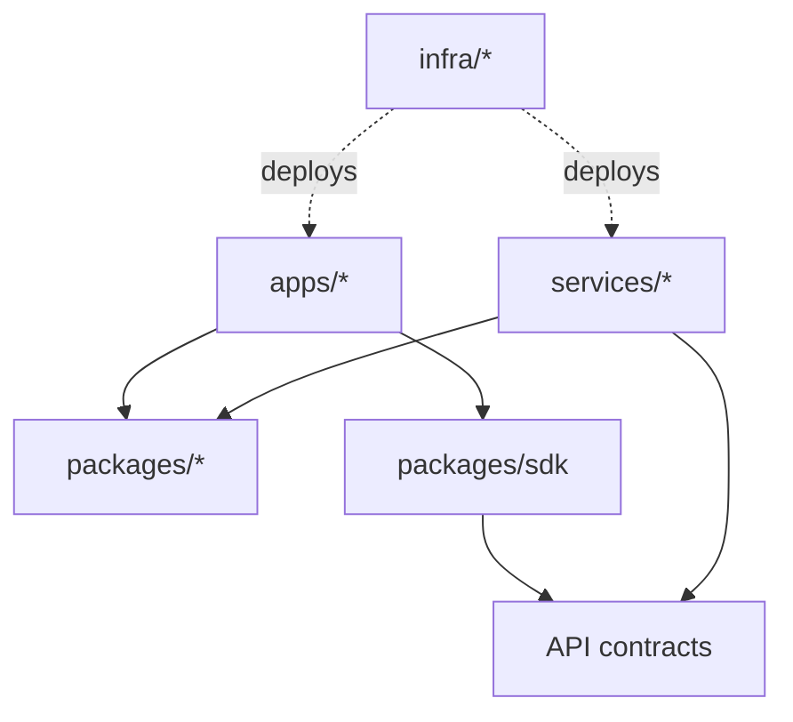

# Architecture

This repository uses a Bun-native, Moon-governed monorepo architecture.

## Core layers

## Governance

* ADRs live in `docs/adr`.
* CODEOWNERS defines review ownership.
* Moon defines project/task graph.
* dependency-cruiser enforces import boundaries.
* Knip detects unused files, dependencies, and exports.
* Syncpack detects dependency version drift.
