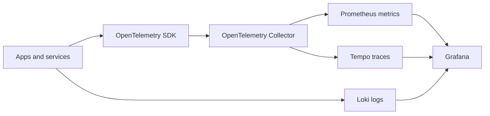

# Observability

Recommended signal flow:

Minimum production requirements:

* RED metrics: request rate, errors, duration
* USE metrics: utilization, saturation, errors
* structured JSON logs
* trace IDs in logs
* SLO dashboard
* paging alert rules
